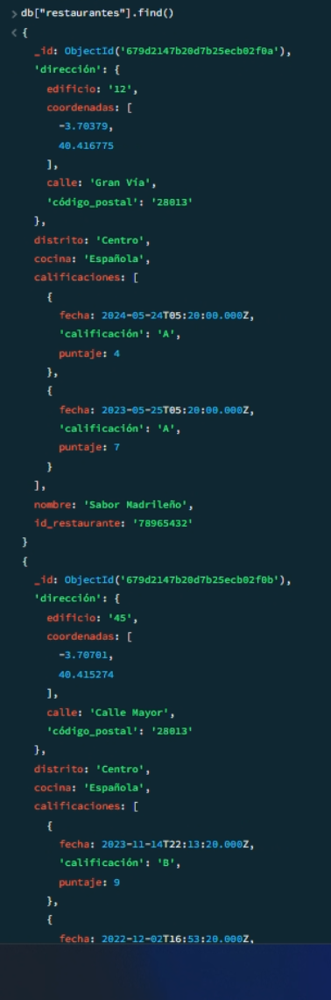
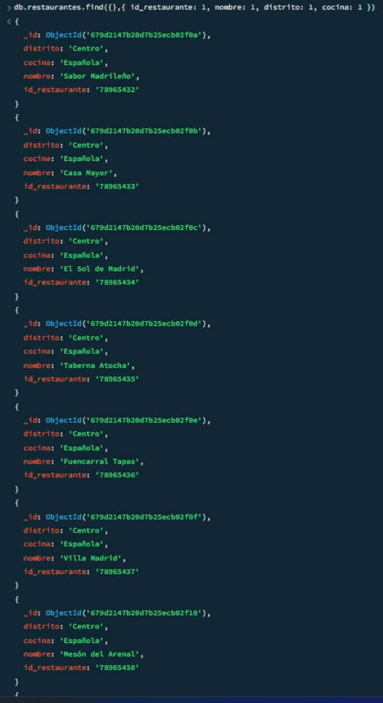
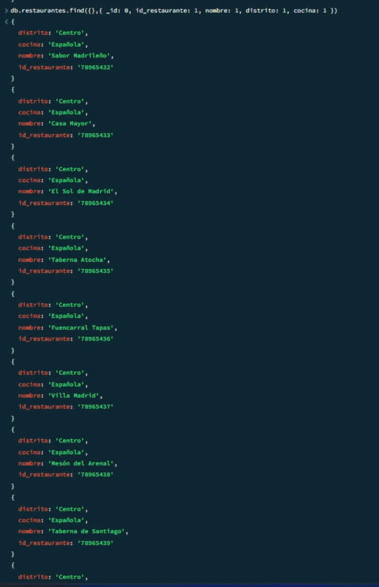
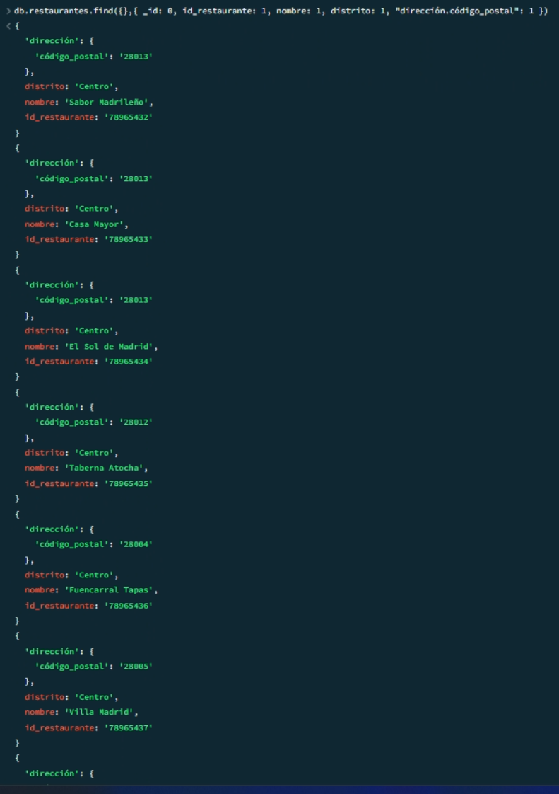
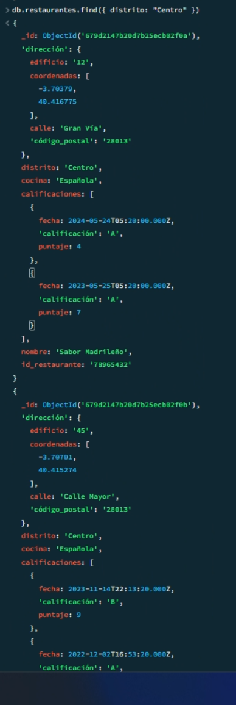
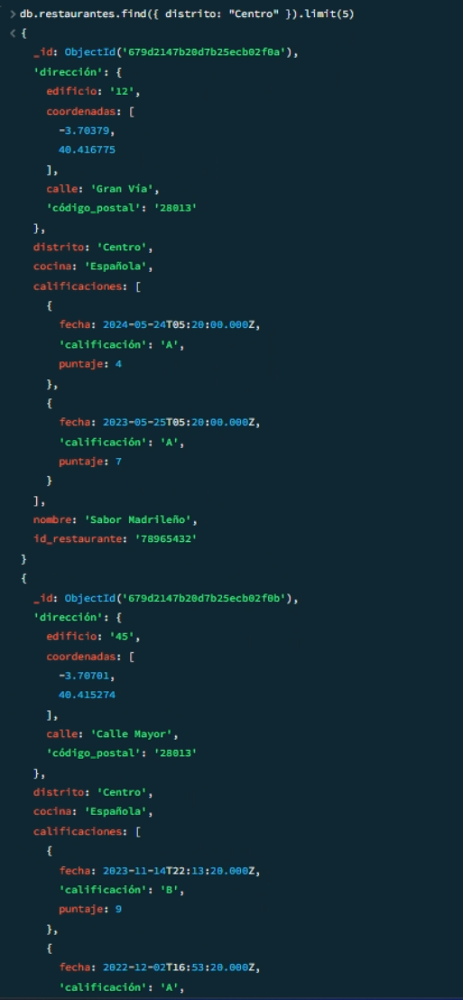
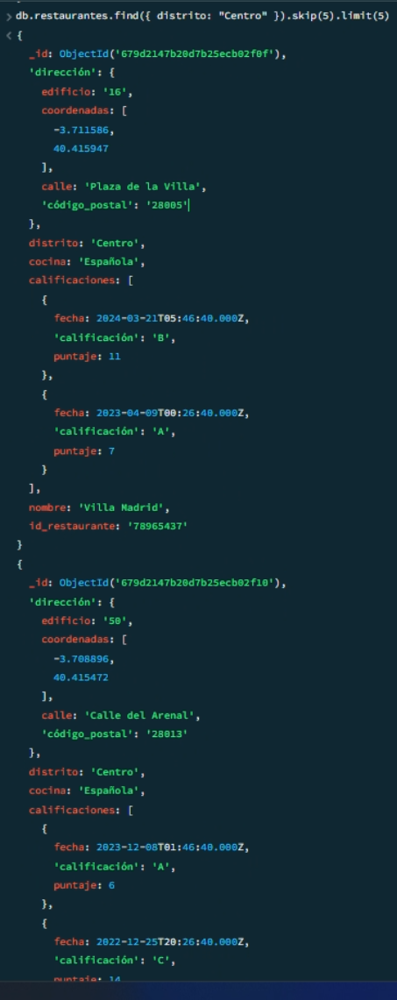
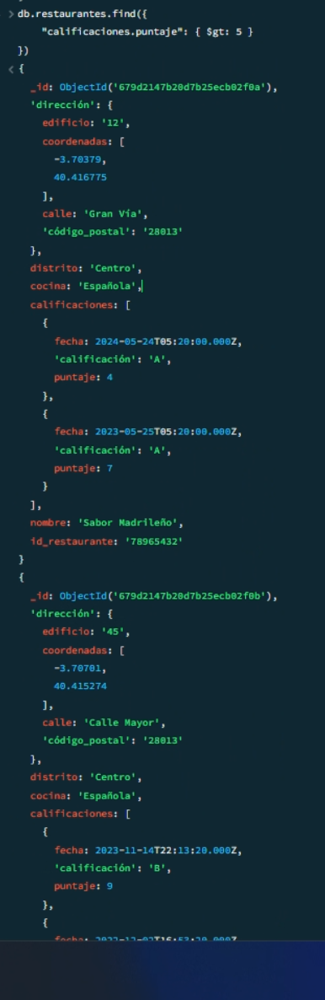
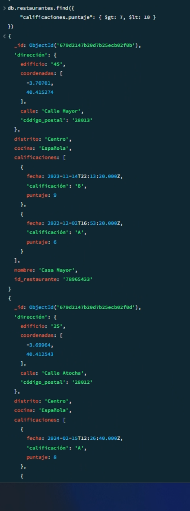
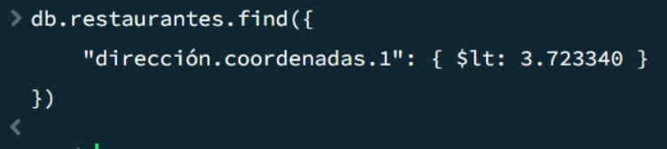

**0. Insertamos los datos de Lista.json:**

<details>
    <summary>Ver código</summary>

    ```javascript
    db.restaurantes.insertMany([
        {
            "dirección": {
                "edificio": "12",
                "coordenadas": [ -3.703790, 40.416775 ],
                "calle": "Gran Vía",
                "código_postal": "28013"
            },
            "distrito": "Centro",
            "cocina": "Española",
            "calificaciones": [
                { "fecha": { "$date": 1716528000000 }, "calificación": "A", "puntaje": 4 },
                { "fecha": { "$date": 1684992000000 }, "calificación": "A", "puntaje": 7 }
            ],
            "nombre": "Sabor Madrileño",
            "id_restaurante": "78965432"
        },
        {
            "dirección": {
                "edificio": "45",
                "coordenadas": [ -3.707010, 40.415274 ],
                "calle": "Calle Mayor",
                "código_postal": "28013"
            },
            "distrito": "Centro",
            "cocina": "Española",
            "calificaciones": [
                { "fecha": { "$date": 1700000000000 }, "calificación": "B", "puntaje": 9 },
                { "fecha": { "$date": 1670000000000 }, "calificación": "A", "puntaje": 6 }
            ],
            "nombre": "Casa Mayor",
            "id_restaurante": "78965433"
        },
        {
            "dirección": {
                "edificio": "8",
                "coordenadas": [ -3.701509, 40.416691 ],
                "calle": "Puerta del Sol",
                "código_postal": "28013"
            },
            "distrito": "Centro",
            "cocina": "Española",
            "calificaciones": [
                { "fecha": { "$date": 1705000000000 }, "calificación": "A", "puntaje": 3 },
                { "fecha": { "$date": 1675000000000 }, "calificación": "A", "puntaje": 5 }
            ],
            "nombre": "El Sol de Madrid",
            "id_restaurante": "78965434"
        },
        {
            "dirección": {
                "edificio": "25",
                "coordenadas": [ -3.699640, 40.412543 ],
                "calle": "Calle Atocha",
                "código_postal": "28012"
            },
            "distrito": "Centro",
            "cocina": "Española",
            "calificaciones": [
                { "fecha": { "$date": 1708000000000 }, "calificación": "A", "puntaje": 8 },
                { "fecha": { "$date": 1678000000000 }, "calificación": "B", "puntaje": 10 }
            ],
            "nombre": "Taberna Atocha",
            "id_restaurante": "78965435"
        },
        {
            "dirección": {
                "edificio": "32",
                "coordenadas": [ -3.705767, 40.420500 ],
                "calle": "Calle de Fuencarral",
                "código_postal": "28004"
            },
            "distrito": "Centro",
            "cocina": "Española",
            "calificaciones": [
                { "fecha": { "$date": 1710000000000 }, "calificación": "A", "puntaje": 7 },
                { "fecha": { "$date": 1680000000000 }, "calificación": "A", "puntaje": 9 }
            ],
            "nombre": "Fuencarral Tapas",
            "id_restaurante": "78965436"
        },
        {
            "dirección": {
                "edificio": "16",
                "coordenadas": [ -3.711586, 40.415947 ],
                "calle": "Plaza de la Villa",
                "código_postal": "28005"
            },
            "distrito": "Centro",
            "cocina": "Española",
            "calificaciones": [
                { "fecha": { "$date": 1711000000000 }, "calificación": "B", "puntaje": 11 },
                { "fecha": { "$date": 1681000000000 }, "calificación": "A", "puntaje": 7 }
            ],
            "nombre": "Villa Madrid",
            "id_restaurante": "78965437"
        },
        {
            "dirección": {
                "edificio": "50",
                "coordenadas": [ -3.708896, 40.415472 ],
                "calle": "Calle del Arenal",
                "código_postal": "28013"
            },
            "distrito": "Centro",
            "cocina": "Española",
            "calificaciones": [
                { "fecha": { "$date": 1702000000000 }, "calificación": "A", "puntaje": 6 },
                { "fecha": { "$date": 1672000000000 }, "calificación": "C", "puntaje": 14 }
            ],
            "nombre": "Mesón del Arenal",
            "id_restaurante": "78965438"
        },
        {
            "dirección": {
                "edificio": "19",
                "coordenadas": [ -3.704472, 40.415381 ],
                "calle": "Calle de Santiago",
                "código_postal": "28013"
            },
            "distrito": "Centro",
            "cocina": "Española",
            "calificaciones": [
                { "fecha": { "$date": 1713000000000 }, "calificación": "A", "puntaje": 4 },
                { "fecha": { "$date": 1683000000000 }, "calificación": "B", "puntaje": 10 }
            ],
            "nombre": "Taberna de Santiago",
            "id_restaurante": "78965439"
        },
        {
            "dirección": {
                "edificio": "4",
                "coordenadas": [ -3.701875, 40.415869 ],
                "calle": "Calle de Esparteros",
                "código_postal": "28012"
            },
            "distrito": "Centro",
            "cocina": "Española",
            "calificaciones": [
                { "fecha": { "$date": 1714000000000 }, "calificación": "A", "puntaje": 5 },
                { "fecha": { "$date": 1684000000000 }, "calificación": "A", "puntaje": 6 }
            ],
            "nombre": "Esparteros Gastrobar",
            "id_restaurante": "78965440"
        },
        {
            "dirección": {
                "edificio": "30",
                "coordenadas": [ -3.710120, 40.412582 ],
                "calle": "Cava Baja",
                "código_postal": "28005"
            },
            "distrito": "Centro",
            "cocina": "Española",
            "calificaciones": [
                { "fecha": { "$date": 1715000000000 }, "calificación": "A", "puntaje": 3 },
                { "fecha": { "$date": 1685000000000 }, "calificación": "A", "puntaje": 8 }
            ],
            "nombre": "La Cava Madrileña",
            "id_restaurante": "78965441"
            ```

</details>


**1. Escribe una consulta en MongoDB para mostrar todos los documentos en la colección restaurantes.**

```javascript
db.restaurantes.find()
```



---

**2. Escribe una consulta en MongoDB para mostrar los campos id_restaurante, nombre, distrito y cocina para todos los documentos en la colección restaurantes.**

```javascript
db.restaurantes.find(
    {},
    { id_restaurante: 1, nombre: 1, distrito: 1, cocina: 1 }
)
```



---

**3. Escribe una consulta en MongoDB para mostrar los campos id_restaurante, nombre, distrito y cocina, pero excluir el campo _id para todos los documentos en la colección restaurantes.**

```javascript
db.restaurantes.find(
    {},
    { _id: 0, id_restaurante: 1, nombre: 1, distrito: 1, cocina: 1 }
)
```



---

**4. Escribe una consulta en MongoDB para mostrar los campos id_restaurante, nombre, distrito y código_postal, pero excluir el campo _id para todos los documentos en la colección restaurantes.**

```javascript
db.restaurantes.find(
    {},
    { 
        _id: 0, 
        id_restaurante: 1, 
        nombre: 1, 
        distrito: 1, 
        "dirección.código_postal": 1 
    }
)
```



---

**5. Escribe una consulta en MongoDB para mostrar todos los restaurantes que están en el distrito "Centro".**

```javascript
db.restaurantes.find({ distrito: "Centro" })
```



---

**6. Escribe una consulta en MongoDB para mostrar los primeros 5 restaurantes que están en el distrito "Centro".**

```javascript
db.restaurantes.find({ distrito: "Centro" }).limit(5)
```



---

**7. Escribe una consulta en MongoDB para mostrar los siguientes 5 restaurantes, después de omitir los primeros 5 que están en el distrito "Centro" de Madrid.**

```javascript
db.restaurantes.find({ distrito: "Centro" }).skip(5).limit(5)
```



---

**8. Escribe una consulta en MongoDB para encontrar los restaurantes en Madrid que han obtenido un puntaje superior a 5 en alguna de sus calificaciones.**

```javascript
db.restaurantes.find({
    "calificaciones.puntaje": { $gt: 5 }
})
```



En caso de sólo querer mostrar las calificaciones mayores a 5:
```javascript
db.restaurantes.find(
  { "calificaciones.puntaje": { $gt: 5 } },
  { nombre: 1, calificaciones: { $elemMatch: { puntaje: { $gt: 5 } } }, _id: 0 }
)
```

---

**9. Escribe una consulta en MongoDB para encontrar los restaurantes en Madrid que han obtenido un puntaje superior a 7 pero inferior a 10 en alguna de sus calificaciones.**

```javascript
db.restaurantes.find({
    "calificaciones.puntaje": { $gt: 7, $lt: 10 }
})
```



---

**10. Escribe una consulta en MongoDB para encontrar los restaurantes cuya latitud es menor que 3.723340.**

```javascript
db.restaurantes.find({
    "dirección.coordenadas.1": { $lt: 3.723340 }
})
```

